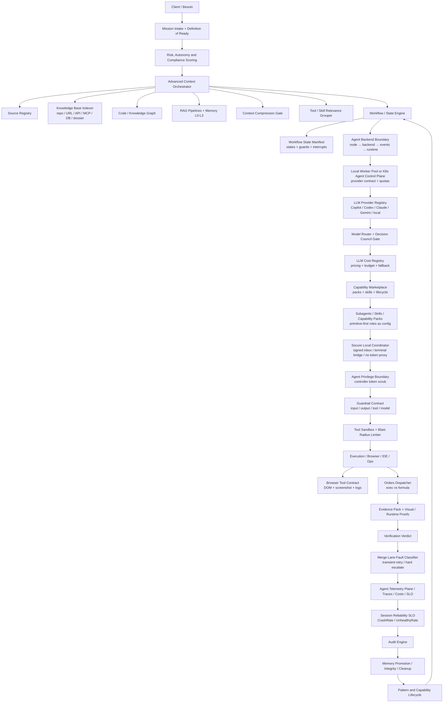

# Architecture cible issue des références agentiques

> Statut : annexe informative. Cette page synthétise les références analysées et alimente la norme, mais les obligations normatives restent définies dans [Norme de structure agentique](norme-structure-agentique.md), [Exigences normatives](exigences-normatives-structure-agentique.md) et [Matrice normative maîtresse](matrice-normative-maitresse.md).

Cette page consolide la revue des projets de référence présents dans `/mnt/Travail/Projets/Dev/Référence-Agentique/`. Elle transforme les idées récurrentes en briques récupérables pour le standard : patterns, contrôles, diagrammes, observabilité, télémétrie et gouvernance.

Le plan de merge complet des ajouts à réaliser est détaillé dans [Plan complet d'ajouts à la conception agentique](plan-ajouts-conception-agentique.md).

## Sources de convergence

| Cluster | Projets représentatifs | Apport principal |
| --- | --- | --- |
| Orchestration graph/workflow | LangGraph, Conductor, AutoGen, crewAI, BMAD, Dify, Langflow | Missions sous forme de graphes/workflows durables, interruptibles et auditables. |
| Contexte, mémoire et compression | CodeGraphContext, graphify, Haystack, mempalace, LLMLingua, VS Code Copilot Chat | Context pack enrichi par graphes, RAG, mémoire durable, compression contrôlée et regroupement intelligent de tools. |
| Observabilité, télémétrie et audit | Langfuse, OpenAI Agents SDK, gascity-otel, VS Code Copilot Chat, OpenHands, Octogent | Traces, métriques, prompts, outils, verdicts, coûts, evals et SLO corrélés. |
| Sécurité, sandbox et gouvernance outil | agent-sandbox, LLMSecurityGuide, OpenHands, kagent, browser-use, gas-town/gascity | Sandbox, guardrails, prompt injection firewall, dry-run, blast-radius limiter et séparation de privilèges controller/agent (ScrubTokenEnv). |
| Skills, packs et marketplace | agent-skills, claude-skills, superpowers, gas town | Capacités distribuables avec lifecycle, tests, permissions et rétention ; modèle primitive-first (rôles = configs, non types SDK). |
| UI, navigateur et preuves visuelles | browser-use, pixel-agents, Design, Dify, Langflow | Preuves UX : DOM, capture, parcours, état visuel et validation design. |
| Runtime coding-agent / IDE | VS Code Copilot Chat, OpenHands, openclaw, OpenAI Agents SDK, Octogent, Claude Octopus | Workspace, terminal, navigateur, outils, contexte IDE, councils, worker pools et trajectoires. |

## Schéma idéal

La source autonome est disponible dans [../diagrammes/schema-ideal-reference-agentique.mmd](../diagrammes/schema-ideal-reference-agentique.mmd).

## Patterns candidats à intégrer

| Pattern | Inspiration | Intention | Destination |
| --- | --- | --- | --- |
| Workflow State Engine | LangGraph, Conductor, Dify, Langflow | Exécuter des missions comme graphes durables, auditables et interruptibles. | Orchestration et contexte. |
| Capability Marketplace | gas town, claude-skills, agent-skills, superpowers | Distribuer skills, packs et capacités avec lifecycle, tests, permissions et rétention. | Runtime et évolution. |
| Advanced Context Orchestrator | LangGraph, Haystack, CodeGraphContext, graphify, mempalace, LLMLingua, VS Code Copilot Chat | Composer sources, graphe, RAG, mémoire L0-L3, compression et sélection de tools avec provenance. | Orchestration, mémoire et contexte. |
| Agent Backend Boundary | Dify `dify-agent`, OpenHands, Agent Framework | Séparer node workflow, backend agent, transport d'événements, SDK et runtime outils pour éviter un core monolithique. | Runtime et orchestration. |
| Context Compression Gate | LLMLingua, CodeGraphContext, Haystack, VS Code Copilot Chat | Réduire le contexte sans perdre provenance, contraintes, atomicité tool-call/tool-result ni preuves. | Orchestration et contexte. |
| Source Graph Resolver | CodeGraphContext, graphify, Haystack, mempalace | Relier documents, code, décisions, preuves, triples temporels et contradictions. | Mémoire et connaissances. |
| Agent Telemetry Plane | Langfuse, OpenAI Agents SDK, gascity-otel, Octogent | Normaliser traces, métriques, logs, coûts, tool calls et événements agentiques. | Audit, observabilité et télémétrie. |
| Tool Blast-Radius Limiter | agent-sandbox, OpenHands, browser-use, kagent | Limiter fichiers, réseau, environnement, coût et production par tâche. | Gouvernance et contrôles. |
| Visual Evidence Pack | browser-use, pixel-agents, Design | Ajouter DOM, screenshots, parcours et validation UX aux preuves. | Preuves et qualité. |
| Remote Hygiene Guard | openclaw | Détecter refs obsolètes, branches massives, tags et fraîcheur repo. | Audit et contrôles de source. |
| Decision Council Gate | Claude Octopus, AutoGen, OpenAI Agents SDK | Escalader les décisions critiques avec quorum, veto critique, budget cap et trace des désaccords. | Gouvernance et validation. |
| Local Agent Worker Pool | Octogent, Conductor, Shannon, gas town | Exécuter des batchs/DAG locaux avec slots, retries, cancellation et traces. | Runtime et orchestration. |
| Evidence-Gated Workflow FSM | Switchboard, BMAD, superpowers, Shannon | Avancer dans un workflow seulement si les preuves requises sont produites. | Qualité et audit. |
| Secure Local Coordinator | Switchboard, VS Code Copilot Chat, Everything Claude Code | Coordonner plusieurs agents locaux sans proxy de credentials, avec terminal/inbox officiels, signatures et gates. | Sécurité et runtime IDE. |
| Kubernetes Agent Control Plane | kagent, agent-sandbox, gas-town/gascity | Déclarer agents, sandboxes, skills, modèles, mémoires et policies comme ressources réconciliées et observables ; fournir un K8s provider natif (client-go, resource limits, node affinity, prebaked images). | Production et plateforme. |
| Agent Privilege Boundary | gas-town/gascity | Séparer permissions controller/agent et scrubber les tokens d'infrastructure avant spawn pour empêcher l'escalade de privilèges. | Gouvernance et contrôles. |
| Merge Lane Fault Classifier | gas-town/gascity | Classifier les échecs de review/merge en transient retryable ou hard escaladé avant toute relance automatique. | Gouvernance et qualité. |
| LLM Cost Registry | gas-town/gascity | Maintenir un registre de coûts par modèle/provider/rig avec précédence defaults -> pack -> city pour alimenter alertes et SLO coût. | Observabilité et télémétrie. |
| Session Reliability SLO Reporter | gas-town/gascity | Mesurer CrashRate% et UnhealthyRate% par model, prompt version et rig pour piloter la fiabilité des sessions agent. | Observabilité et SLO. |
| Orders Exec/Formula Dispatcher | gas-town/gascity | Séparer les ordres shell-only sans session agent des workflows agentiques instanciés afin de clarifier coût, risque et preuve attendue. | Runtime et orchestration. |
| Primitive-First Capability Model | gas-town/gascity | Définir rôles et capacités comme configs de pack plutôt que comme types SDK hardcodés. | Runtime et évolution. |
| Guardrail Contract | OpenAI Agents SDK, LLMSecurityGuide, kagent | Versionner input/output/tool/model guardrails avec modes, décisions, preuves et incidents. | Gouvernance et contrôles. |
| Runtime Provider Contract | OpenHands, agent-sandbox, gascity, kagent | Uniformiser lifecycle, ressources, logs, santé et cleanup pour runtimes locaux, IDE, distants ou K8s. | Runtime et évolution. |
| Prompt/version observability | Langfuse, VS Code Copilot Chat, OpenAI Agents SDK | Relier versions de prompts, skills, providers, modèles et evals aux régressions. | Observabilité et qualité. |
| Doc-to-graph pipeline | graphify, CodeGraphContext | Construire un graphe documentaire sourcé pour relations, contradictions et couverture. | Mémoire et connaissances. |

### Correspondance normative

| Candidat initial | ID normalisé |
| --- | --- |
| Prompt Injection Firewall | GOV-12 |
| Remote Hygiene Guard | GOV-13 |
| Decision Council Gate | GOV-14 |
| Visual Evidence Pack | QUA-12 |
| Eval lifecycle | QUA-13 |
| Source Graph Resolver | KNO-10 |
| Secure Local Coordinator | RUN-12 |

## Contrôles à récupérer

| Contrôle | Rôle |
| --- | --- |
| Context Compression Gate | Autoriser compression ou réduction de contexte seulement si contraintes et provenance restent vérifiables. |
| Tool Blast-Radius Limiter | Définir l'impact maximal d'un outil par tâche : fichiers, réseau, environnement, coût, production. |
| Prompt Injection Firewall | Isoler le contenu externe et empêcher qu'il modifie les instructions de contrôle. |
| Remote Hygiene Guard | Vérifier fraîcheur, refs distantes, tags, branches et accessibilité du remote avant audit de source. |
| Visual Evidence Gate | Exiger capture, DOM, parcours ou rendu quand une livraison UI/UX est concernée. |
| Capability Promotion Gate | Promouvoir une skill ou pack seulement après usage, preuve, propriétaire, version et test de compétence. |
| MCP Trust Gate | Vérifier origine, permissions, variables d'environnement et surface des serveurs MCP avant exposition aux agents. |
| Memory Integrity Validator | Contrôler provenance, dérive, empoisonnement et expiration des mémoires promues. |
| Decision Council Gate | Imposer quorum, veto, budget et justification sourcée pour décisions haut risque ou haute incertitude. |
| Agent Backend Boundary | Imposer des contrats explicites entre workflow node, backend agent, transport d'événements et runtime outils. |
| Secure Local Coordinator | Interdire les proxys de tokens ; utiliser des canaux locaux officiels, signés, sessionnés et soumis aux gates de workflow. |
| Kubernetes Agent Control Plane | Exiger provider natif, quotas, resource limits, network allowlists, service accounts et télémétrie OTel pour agents/sandboxes en cluster. |
| Agent Privilege Boundary | Séparer explicitement les permissions controller/agent ; scrubber les tokens d'infrastructure avant spawn des agents pour empêcher l'escalade de privilèges. |
| Merge Lane Fault Classifier | Classifier les échecs de merge/review en transient (retryable : rate limit, timeout provider) vs hard (escalade) pour éviter les retry inutiles et les blocages silencieux. |
| LLM Cost Registry | Journaliser coûts et tokens par modèle, provider, rig et mission ; bloquer ou escalader en cas de dépassement budgétaire. |
| Session Reliability SLO Reporter | Suivre CrashRate%, UnhealthyRate%, idle kills et quarantaines par rig/model pour déclencher remediation ou retrait de capacité. |

## Conflits et arbitrages

| Conflit | Arbitrage retenu |
| --- | --- |
| Autonomie forte vs validation | L'autonomie reste graduée par tâche avec Autonomy Level Gate, dry-run et validation authority. |
| Observabilité complète vs confidentialité | Les traces doivent être corrélées mais minimisées, masquées et gouvernées par rétention. |
| Mémoire riche vs source de vérité | La constitution du contexte garde source active et preuve au-dessus de la mémoire et de la similarité. |
| Marketplace de capacités vs prolifération | Toute capacité a statut, owner, tests, expiration, promotion ou purge. |
| Workflow visuel vs norme textuelle | Le standard accepte visual builders si un manifest exportable et auditable existe. |
| Graphe durable vs simplicité | Les graphes durables sont requis seulement à partir des profils orchestrés/gouvernés. |
| Repos très actifs vs audit de fraîcheur | Le Remote Hygiene Guard devient un contrôle de source pour éviter les audits sur refs obsolètes. |
| Worker pool local vs orchestration durable | Les tâches courtes/batch utilisent Local Agent Worker Pool ; les workflows critiques utilisent Workflow State Engine. |
| Council multi-modèle vs coût/latence | Le Council est réservé aux décisions irréversibles, sécurité, architecture ou désaccords persistants. |
| Runtime intégré vs backend agent découplé | Le standard exige une boundary explicite dès que le runtime porte plugins, tools, SSE/events ou sandboxes. |
| Coordination locale vs conformité fournisseur | Les agents locaux doivent conserver leurs propres authentifications et limites ; aucun token d'un outil ne doit être routé vers un autre. |
| K8s production vs simplicité locale | Les CRDs et admission policies sont réservées au profil production ; le profil local garde worker pool + sandbox minimal. |
| Controller token vs autonomie agent | Les clés d'infrastructure restent réservées au controller ; tout environnement agent est scrubbed avant spawn. |
| Coût LLM vs opacité fournisseur | Les coûts doivent être observables dans notre registre interne même si la facturation provider arrive plus tard. |
| Retry automatique vs boucle infinie | Chaque gate retryable doit classifier transient/hard avant relance, avec budget et escalade explicites. |

## Plan d'intégration recommandé

1. Ajouter les nouveaux patterns candidats aux familles existantes selon leur destination.
2. Étendre le catalogue des contrôles avec les gates listés ci-dessus, notamment `Agent Privilege Boundary`, `Merge Lane Fault Classifier`, `LLM Cost Registry` et `Session Reliability SLO Reporter`.
3. Ajouter les modèles opérationnels : `capability-pack`, `workflow-state-manifest`, `context-orchestration-manifest`, `agent-backend-contract`, `telemetry-evidence-schema`, `order-dispatcher-contract` et `controller-agent-privilege-contract`.
4. Relier `Agent Telemetry Plane` aux exigences `AG-OBS-*`, avec traces, coûts, tool calls, evals, evidence ledger et métriques CrashRate/UnhealthyRate.
5. Ajouter `Remote Hygiene Guard`, `MCP Trust Gate`, `Memory Integrity Validator`, `Agent Privilege Boundary` et `Merge Lane Fault Classifier` à la matrice risques, contrôles et preuves.
6. Ajouter `Visual Evidence Pack` aux profils de preuve et aux verdicts de validation UI.
7. Définir trois profils d'exécution : `local-worker-pool`, `workflow-durable` et `k8s-agent-control-plane`, avec provider K8s natif en profil production.
8. Normaliser la séparation orders `exec`/`formula` pour distinguer commandes shell-only, workflows agentiques, budget token et preuves attendues.

## Règle finale

Le schéma cible ne doit pas transformer le standard en dépendance à un framework. Il doit extraire les invariants utiles : graphe d'exécution, contexte gouverné, capacités versionnées, outils limités, preuves vérifiables, télémétrie corrélée et amélioration continue.
