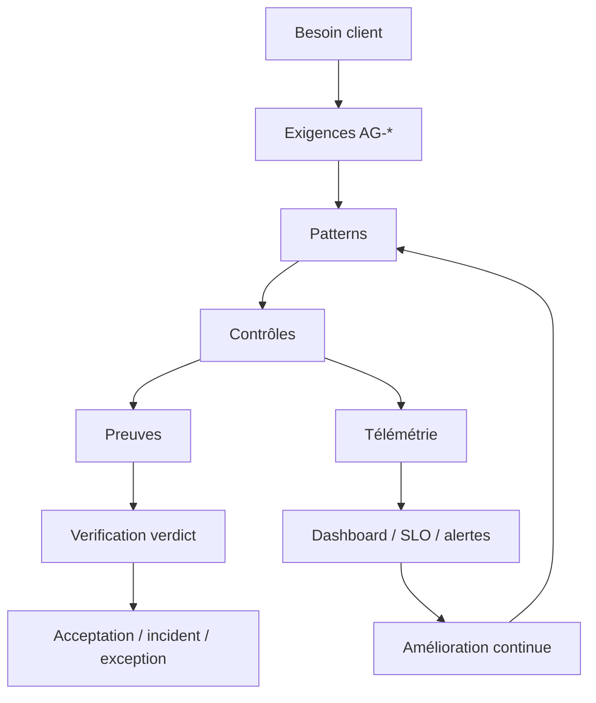

# Audit et conformité agentique

Cette page définit le bloc audit-ready du standard. Elle relie exigences, risques, contrôles, preuves, exceptions, observabilité et télémétrie pour permettre à une structure agentique d'être évaluée, comparée et améliorée.

## Objectif

Une structure agentique conforme doit pouvoir répondre à cinq questions :

| Question | Preuve attendue |
| --- | --- |
| Que devait faire l'agent ? | brief, carte Kanban, task envelope, critères. |
| Pourquoi a-t-il agi ainsi ? | context pack, trace, décision, policy, modèle utilisé. |
| Quels risques étaient présents ? | registre risques IA, matrice risques-contrôles-preuves. |
| Quels contrôles ont fonctionné ? | hook, gate, dry-run, validation, evidence pack. |
| Que garde-t-on pour audit et amélioration ? | mission ledger, télémétrie, verdict, exception ou incident. |

## Documents du bloc audit

| Document | Rôle |
| --- | --- |
| [Catalogue des contrôles agentiques](catalogue-controles-agentiques.md) | Liste les contrôles utilisables : hooks, gates, validations, evals, audits, policies. |
| [Matrice risques, contrôles et preuves](matrice-risques-controles-preuves.md) | Relie chaque risque agentique à ses mitigations et preuves. |
| [Checklist d'évaluation de conformité](checklist-evaluation-conformite.md) | Permet d'auditer un système par niveau de conformité. |
| [Gestion des exceptions de conformité](gestion-exceptions-conformite.md) | Encadre les écarts temporaires aux exigences. |
| [Modèle de traçabilité agentique](modele-tracabilite-agentique.md) | Définit la chaîne besoin -> exigence -> pattern -> contrôle -> preuve -> verdict. |
| [Observabilité et télémétrie agentiques](observabilite-telemetrie-agentique.md) | Définit traces, métriques, logs, événements, dashboards, alertes et rétention. |

## Chaîne de conformité

La source autonome est disponible dans [../diagrammes/audit-observabilite-agentique.mmd](../diagrammes/audit-observabilite-agentique.mmd).

## Niveaux d'auditabilité

| Niveau | Capacité |
| --- | --- |
| A0 | Audit impossible : décisions non tracées. |
| A1 | Audit documentaire : artefacts présents mais collecte manuelle. |
| A2 | Audit traçable : ledgers, preuves et décisions reliés. |
| A3 | Audit observable : traces, métriques et logs structurés. |
| A4 | Audit gouverné : alertes, SLO, exceptions et incidents pilotés. |
| A5 | Audit apprenant : télémétrie et incidents améliorent patterns, evals et contrôles. |

## Règle finale

La conformité agentique ne repose pas sur la présence de documents, mais sur une chaîne active : exigence, contrôle, preuve, verdict, télémétrie et amélioration.
