# Diagramme de décision agentique

Ce diagramme transpose le processus humain du besoin au livrable dans un cadre agentique. L'utilisateur est le client. L'agent est l'entreprise qui reçoit, cadre, conçoit, exécute, vérifie, sécurise, trace et livre. Le but n'est pas de faire demander plus souvent à l'agent, mais de l'obliger à qualifier le besoin, exploiter le contexte disponible, orchestrer les bons rôles et produire des preuves.

Les références structurantes sont listées dans [references-agentiques.md](references-agentiques.md). Les questions détaillées sont dans [questionnaires-agentiques.md](questionnaires-agentiques.md). L'architecture interne est décrite dans [architecture-pilotage-agentique.md](architecture-pilotage-agentique.md), l'orchestration fine du contexte dans [orchestration-contexte-agentique.md](orchestration-contexte-agentique.md), la couche anti-défauts IA dans [defauts-ia-et-fiabilite.md](defauts-ia-et-fiabilite.md), l'observabilité dans [observabilite-evals-slo-agentiques.md](observabilite-evals-slo-agentiques.md) et le routage/rétention dans [routage-llm-retention-connaissances.md](routage-llm-retention-connaissances.md).

```mermaid
flowchart TD
    A([Signal client ou opportunite]) --> B{Objectif de mission ?}

    B -- "Creation de produit" --> C1["Intake entreprise-agent<br/>vision, valeur, parties prenantes"]
    B -- "Evolution ou correction" --> C2["Audit cible<br/>symptome, comportement attendu, zone impactee"]
    B -- "Refactoring ou reprise" --> C3["Audit existant<br/>dette, architecture, tests, risques"]
    B -- "Analyse securite" --> C4["Regles d'engagement<br/>assets, autorisation, limites"]
    B -- "Agent ou automatisation IA" --> C5["Cadrage agentique<br/>autonomie, outils, contexte, evals"]
    B -- "Operation externe" --> C6["Controle impact externe<br/>cout, reseau, cloud, depot, production"]
    B -- "Autre" --> C7["Qualification<br/>livrable, contrainte, definition de succes"]

    C1 --> D
    C2 --> D
    C3 --> D
    C4 --> D
    C5 --> D
    C6 --> D
    C7 --> D

    D{Besoin client testable ?}
    D -- Non --> E["Discovery assistee<br/>5W2H, 5 Why, personas, parcours, risques"]
    E --> F{Information deduisible du contexte ?}
    F -- Oui --> G["Explorer le reel<br/>workspace, docs, historique, erreurs, references officielles"]
    F -- Non --> H["Questions ciblees au client<br/>valeur, scope, hors-scope, criteres, contraintes"]
    G --> D
    H --> D

    D -- Oui --> I["CDC niveau 0<br/>probleme, objectifs, valeur, scope, hors-scope, risques"]
    I --> J{Surface de solution ?}
    J -- "Frontend ou UX" --> K1["Cadrage UI/UX et DA<br/>parcours, etats, design system, accessibilite, prototype"]
    J -- "Backend ou donnees" --> K2["Cadrage backend<br/>API, donnees, regles, auth, integrations"]
    J -- "Fullstack" --> K3["Cadrage front et back<br/>flux, contrats, modeles, experience"]
    J -- "Plateforme agentique" --> K4["Cadrage agent<br/>prompt, skills, tools, MCP, hooks, memoire"]
    J -- "Lot technique" --> K5["Cadrage technique<br/>dette, performance, exploitation, migration"]

    K1 --> L
    K2 --> L
    K3 --> L
    K4 --> L
    K5 --> L

    L["CDC niveau 1<br/>comportements, parcours, user stories, acceptation"] --> M{Contraintes qualite et fiabilite definies ?}
    M -- Non --> N["CDC niveau 2<br/>ISO 25010, securite, accessibilite, performance, data, ops, AI risk"]
    N --> M
    M -- Oui --> M2{Defauts IA couverts ?}

    M2 -- Non --> N2["Barriere anti-defauts IA<br/>hallucination, surconfiance, oubli, complaisance, faux Done"]
    N2 --> M2
    M2 -- Oui --> O{Architecture et vues suffisantes ?}

    O -- Non --> P["Architecture applicative et agentique<br/>C4, UML, BPMN, ADR, menaces, decisions"]
    P --> O
    O -- Oui --> Q{Contexte operationnel exploitable ?}

    Q -- Non --> R["Context engineering<br/>workspace, docs, vector DB, Redis chaud, sources, fraicheur, confiance"]
    R --> Q
    Q -- Oui --> Q2{Profil de contexte defini ?}

    Q2 -- Non --> R2["Context orchestration layer<br/>etape, budget, sources, task envelope, handoff"]
    R2 --> Q2
    Q2 -- Oui --> Q3{Modeles et connaissances gouvernes ?}

    Q3 -- Non --> R3["Routage LLM et retention<br/>modele par tache, fallback, TTL, desindexation, purge"]
    R3 --> Q3
    Q3 -- Oui --> S{Orchestration prete ?}

    S -- Non --> T["Configurer l'entreprise-agent<br/>prompts, skills, outils, MCP, hooks, subagents, permissions"]
    T --> S
    S -- Oui --> U{Backlog pilotable ?}

    U -- Non --> V["CDC niveau 3 et Kanban<br/>lots, taches, DoR, DoD, dependances, risques, WIP"]
    V --> U
    U -- Oui --> W["Cycle continu agentique<br/>selection lot, plan court, execution, verification, livraison"]

    W --> W2{Dry-run requis ?}
    W2 -- Oui --> W3["Simulation pre-execution<br/>impact, permissions, cout, rollback, validation"]
    W3 --> X
    W2 -- Non --> X

    X["Execution orchestree<br/>agent principal, subagents analyste, archi, design, dev, QA, securite, critique, ops"]
    X --> Y{Hook ou politique bloque ?}
    Y -- Oui --> Z["Stopper, reduire ou escalader<br/>risque, permission, alternative, decision client"]
    Z --> W
    Y -- Non --> AA["Verification multi-preuves<br/>tests, lint, build, rendu, scans, evals, revue, traces"]

    AA --> AA2{Incident ou anomalie critique ?}
    AA2 -- Oui --> AA3["Reprise agentique<br/>stop, containment, rollback, purge memoire, post-mortem"]
    AA3 --> W
    AA2 -- Non --> AB{Qualite prouvee ?}

    AB -- Non --> AC["Diagnostic et correction<br/>cause racine, patch cible, re-test, mise a jour backlog"]
    AC --> W
    AB -- Oui --> AD{Validation client necessaire ?}

    AD -- Oui --> AE["Dossier d'acceptation<br/>livrable, preuves, risques residuels, decisions"]
    AE --> AF{Client accepte ?}
    AF -- Non --> AG["Reviser besoin, scope ou priorite"]
    AG --> D
    AF -- Oui --> AH["Livrer et capitaliser<br/>docs, journal, memoire validee, backlog, monitoring"]

    AD -- Non --> AH
    AH --> AH2["Mesure continue<br/>SLO, evals, couts, traces, feedback, incidents"]
    AH2 --> AI{Objectifs atteints durablement ?}
    AI -- Non --> AJ["Apprentissage continu<br/>feedback, incident, metriques, evals, amelioration"]
    AJ --> W
    AI -- Oui --> AK([Livrable accepte et suivi])
```

Le même diagramme est disponible dans [../diagrammes/cycle-agentique.mmd](../diagrammes/cycle-agentique.mmd).

## Lecture du diagramme

| Zone | Question centrale | Livrables attendus |
| --- | --- | --- |
| Intake | Quelle mission l'entreprise-agent reçoit-elle du client ? | fiche mission, objectif, livrable, risques initiaux |
| Besoin | Le problème est-il compris avant la solution ? | questions ciblées, hypothèses, valeur, critères de succès |
| CDC | Quel niveau de détail est nécessaire pour agir sans dérive ? | CDC niveaux 0, 1, 2 et backlog niveau 3 |
| Défauts IA | Quels modes d'échec du modèle doivent être neutralisés ? | registre défauts IA, claim ledger, critique, evals ciblées |
| Architecture | Quelles vues réduisent le risque ? | C4, UML, BPMN, ADR, menaces, décisions |
| Contexte | Quelles sources sont fiables, fraîches et utiles ? | inventaire contexte, vector DB, Redis chaud, scores de confiance |
| Budget de contexte | Quel contexte minimal suffit pour l'étape et le subagent ? | profil, budget, task envelope, handoff packet |
| Modèles et connaissances | Quel modèle utiliser et quelles connaissances sont fiables ? | routage LLM, fallback, métadonnées, TTL, désindexation, purge |
| Orchestration | Quels rôles, outils et permissions sont nécessaires ? | prompts, skills, tools, MCP, hooks, subagents |
| Simulation | Faut-il simuler avant d'agir ? | dry-run, impact, permissions, rollback, validation |
| Pilotage | Comment éviter le travail invisible ? | Kanban, DoR, DoD, dépendances, WIP, journal |
| Qualité | Qu'est-ce qui prouve que le résultat est fiable ? | tests, scans, evals, red teaming, rendu, logs, revue |
| Incidents | Que faire si l'agent se trompe ou casse quelque chose ? | stop, containment, rollback, purge mémoire, post-mortem |
| Observabilité | Comment mesurer la fiabilité et l'amélioration ? | traces, SLO, evals, coûts, scorecards, métriques |
| Livraison | Que doit accepter le client ? | dossier d'acceptation, risques résiduels, monitoring, mémoire |

## Points de retour normaux

Les retours arrière sont attendus. Ils surviennent quand le besoin reste ambigu, qu'une source de contexte est faible, qu'un hook bloque une action, qu'un subagent trouve un risque, qu'une évaluation échoue, qu'une dépendance devient coûteuse, qu'un test contredit l'hypothèse ou qu'une décision métier doit revenir au client.

## Niveau inférieur

Le détail de l'orchestration interne de l'entreprise-agent est disponible dans [diagramme-orchestration-agentique.md](diagramme-orchestration-agentique.md). Le détail de la circulation du contexte est disponible dans [orchestration-contexte-agentique.md](orchestration-contexte-agentique.md). Les contrats de travail et modèles prêts à remplir sont disponibles dans [contrats-operationnels-agentiques.md](contrats-operationnels-agentiques.md).
