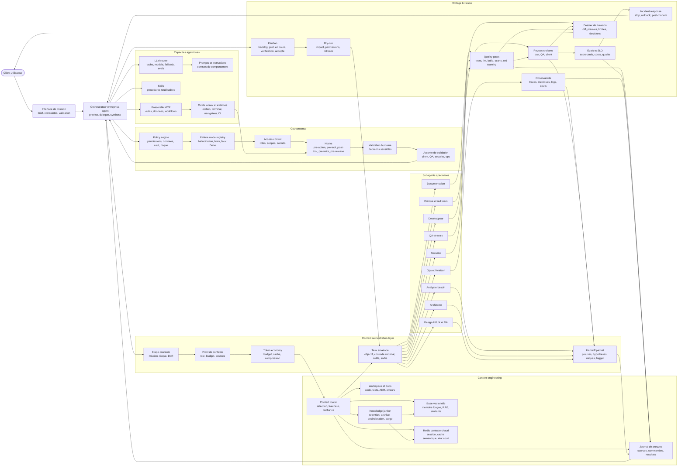

# Diagramme d'orchestration agentique

Ce diagramme montre le niveau inférieur : comment l'entreprise-agent transforme une demande client en exécution contrôlée. Il ne décrit pas un produit particulier, mais une architecture de pilotage réutilisable pour agents outillés.

La source autonome est disponible dans [../diagrammes/orchestration-agentique.mmd](../diagrammes/orchestration-agentique.mmd). Les règles opérables sont détaillées dans [gouvernance-execution-agentique.md](gouvernance-execution-agentique.md), les prompts de rôle dans [prompts-subagents-agentiques.md](prompts-subagents-agentiques.md) et les modes d'échec IA dans [defauts-ia-et-fiabilite.md](defauts-ia-et-fiabilite.md).

## Lecture rapide

| Bloc | Rôle |
| --- | --- |
| Interface de mission | Capture le besoin client, les contraintes, les validations attendues et les permissions. |
| Orchestrateur | Décide quoi traiter, quoi déléguer, quoi vérifier et quoi restituer. |
| Gouvernance | Empêche les actions hors périmètre, risquées, coûteuses ou non autorisées, avec accès, validateurs et défauts IA explicites. |
| Context engineering | Sélectionne les sources utiles, sépare contexte chaud et mémoire longue, nettoie les connaissances obsolètes et trace les preuves. |
| Context orchestration layer | Adapte la taille du contexte à l'étape, économise les tokens, prépare les task envelopes et contrôle les handoff packets. |
| Capacités agentiques | Fournit instructions, routage LLM par tâche, workflows, outils et connecteurs externes. |
| Subagents | Isolent les travaux spécialisés, y compris design/DA et critique/red-team, et réduisent la pollution du contexte principal. |
| Pilotage livraison | Rend le travail visible, vérifiable, priorisé et acceptable par le client avec dry-run, revues, evals, SLO et reprise incident. |

## Intention du niveau inférieur

Le diagramme rend explicite que la fiabilité ne vient pas d'un agent unique qui sait tout. Elle vient d'un système de contrôle : rôles spécialisés, contexte sourcé, outils permissionnés, hooks, preuves, évaluations, traçabilité et validation client.
