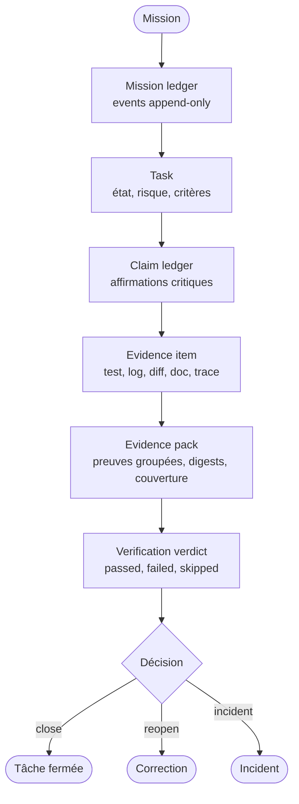

# Ledger, preuves et verdicts agentiques

Cette page formalise la couche de preuve d'une structure agentique. Elle complète le claim ledger avec des primitives plus robustes : mission ledger append-only, evidence items, evidence packs et verification verdicts.

## Principe

Une structure agentique mature NE DOIT PAS se contenter de déclarer qu'une tâche est faite. Elle DOIT produire une trace vérifiable reliant mission, tâche, affirmation, preuve, verdict et décision de fermeture.

La source autonome est disponible dans [../diagrammes/ledger-preuves-verdicts.mmd](../diagrammes/ledger-preuves-verdicts.mmd).

## Mission ledger append-only

Le mission ledger est le journal immuable des missions, tâches, transitions et incidents. Il reconstitue l'état par événements, au lieu d'écraser l'état précédent.

| Élément | Exigence |
| --- | --- |
| Mission | possède identifiant, titre, origine, statut, risque, scope. |
| Tâche | possède mission liée, type, statut, risque, owner, critères. |
| Événement | décrit qui a changé quoi, quand et pourquoi. |
| Transition | respecte une machine d'état autorisée. |
| Incident | lie anomalie à mission, tâche, gravité, causes et actions. |

## États minimaux

| Objet | États minimaux |
| --- | --- |
| Mission | draft, open, blocked, verifying, closed, cancelled. |
| Tâche | proposed, ready, running, blocked, needs_verification, failed, closed, cancelled. |
| Incident | open, accepted, resolved. |

Une fermeture directe d'une tâche à risque DEVRAIT être interdite si la tâche n'est pas passée par un état de vérification.

## Claim ledger

Le claim ledger relie les affirmations importantes aux preuves. Il répond à la question : pourquoi l'agent croit-il ce qu'il affirme ?

| Champ | Rôle |
| --- | --- |
| claim_id | identifiant de l'affirmation. |
| task_id | tâche liée. |
| statement | affirmation à vérifier. |
| claim_type | fait, décision, hypothèse, limite, risque. |
| evidence_refs | preuves associées. |
| confidence | confiance déclarée. |
| status | proven, assumed, contradicted, obsolete. |
| owner | rôle responsable de la vérification. |

## Evidence item

Un evidence item est une preuve atomique.

| Type | Exemples |
| --- | --- |
| test | sortie de test, rapport coverage. |
| log | logs de build, CI, outil. |
| diff | patch, comparaison, changement. |
| doc | document source, ADR, contrat. |
| schema | validation JSON/YAML/API. |
| trace | trace agentique, trace OpenTelemetry. |
| screenshot | capture UI ou rendu visuel. |
| report | audit, scan sécurité, rapport QA. |

Chaque evidence item DEVRAIT avoir un digest ou équivalent pour garantir que la preuve citée est stable.

## Evidence pack

Un evidence pack regroupe les preuves nécessaires à une tâche, une release ou une décision.

| Champ | Rôle |
| --- | --- |
| pack_id | identifiant du paquet. |
| task_id | tâche vérifiée. |
| profile | light, standard, strict, security_critical, release. |
| items | preuves atomiques. |
| coverage | critères couverts et manquants. |
| created_at | date de constitution. |
| workflow_instance_id | workflow ou run lié. |

## Profils de preuve

| Profil | Preuves minimales recommandées |
| --- | --- |
| light | test ou vérification simple. |
| standard | test + log. |
| strict | test + log + diff. |
| security_critical | test + log + diff + rapport. |
| release | test + log + diff + doc + rapport. |

Le profil DOIT être proportionné au risque de la carte ou de la mission.

## Verification verdict

Le verdict transforme les preuves en décision.

| Champ | Rôle |
| --- | --- |
| verdict_id | identifiant du verdict. |
| evidence_pack_id | paquet évalué. |
| checks | contrôles exécutés. |
| result | passed, failed, skipped, error. |
| decision | fermer, rouvrir, créer incident, escalader. |
| created_by | validateur ou système. |

Un verdict `passed` sans couverture des critères d'acceptation NE DOIT PAS fermer une tâche à risque.

## Chaîne de traçabilité

| Niveau | Question |
| --- | --- |
| Mission | Quel objectif client est servi ? |
| Tâche | Quel lot vérifiable porte l'action ? |
| Claim | Quelle affirmation doit être prouvée ? |
| Evidence item | Quelle preuve atomique existe ? |
| Evidence pack | Les preuves couvrent-elles les critères ? |
| Verdict | Peut-on fermer, rouvrir ou déclarer incident ? |
| Acceptation | Le client ou validateur accepte-t-il le livrable ? |

## Anti-patterns

| Anti-pattern | Pourquoi il est dangereux |
| --- | --- |
| Done sans preuve | impossible à auditer. |
| Preuve sans critère lié | ne prouve pas le bon résultat. |
| Log volumineux non résumé | difficile à relire et à retenir. |
| Claim critique non sourcé | hallucination possible. |
| Verdict auto-accepté | confusion entre exécution et validation. |
| Preuve mutable sans digest | impossible de garantir ce qui a été validé. |

## Règle finale

Le claim ledger explique les affirmations. L'evidence pack prouve les faits. Le verification verdict décide si la preuve suffit. Les trois couches DOIVENT rester reliées.
