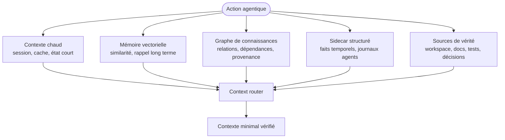

# Mémoire hybride agentique

Cette page décrit une architecture mémoire mature pour structure agentique. Elle complète le couple Redis/vector DB avec graphe, sidecar structuré, journal append-only et registre de sources.

## Principe

Une mémoire agentique mature n'est pas un simple RAG. Elle combine plusieurs formes de mémoire, chacune avec son rôle, ses risques et ses règles de vérité.

La source autonome est disponible dans [../diagrammes/memoire-hybride-agentique.mmd](../diagrammes/memoire-hybride-agentique.mmd).

## Couches de mémoire

| Couche | Usage | Risque | Contrôle |
| --- | --- | --- | --- |
| Fenêtre active | tenir l'objectif immédiat. | saturation, oubli. | handoff court. |
| Contexte chaud | conserver état de mission. | mélange de missions, données périmées. | TTL, tenant, invalidation. |
| Mémoire vectorielle | retrouver documents similaires. | faux rappel, source obsolète. | métadonnées, score, source active. |
| Graphe | relier faits, tâches, agents, preuves. | relations fausses ou anciennes. | provenance, validité temporelle. |
| Sidecar structuré | stocker faits temporels et journaux. | accumulation non révisée. | valid_from, valid_to, confiance. |
| Journal append-only | auditer événements. | volume, données sensibles. | rétention, masquage, purge. |
| Source de vérité | décider avec le réel. | lecture incomplète. | accès direct, version, propriétaire. |

## Vectoriel et graphe

| Besoin | Vectoriel | Graphe |
| --- | --- | --- |
| Retrouver une note similaire | fort | faible |
| Comprendre dépendances | moyen | fort |
| Tracer décision -> preuve -> tâche | moyen | fort |
| Chercher par métadonnées | fort si filtré | fort |
| Détecter contradictions | moyen | fort si relations qualifiées |
| Reconstituer historique | faible | fort avec journal |

Le vectoriel rappelle. Le graphe relie. Aucun des deux ne remplace la source de vérité.

## Sidecar structuré

Le sidecar contient les faits qui ont besoin d'une structure plus précise qu'un texte libre.

| Champ | Usage |
| --- | --- |
| subject | sujet du fait. |
| predicate | relation ou propriété. |
| object | valeur ou cible. |
| valid_from | début de validité. |
| valid_to | fin de validité si connue. |
| confidence | niveau de confiance. |
| source_id | source ayant produit le fait. |
| mission_id | mission liée. |

## Taxonomie de mémoire

Une taxonomie évite que la mémoire devienne un vrac sémantique.

| Niveau | Question |
| --- | --- |
| Domaine | De quel produit, projet, agent ou client parle-t-on ? |
| Catégorie | Est-ce un fait, événement, apprentissage, préférence, conseil ou incident ? |
| Sujet | Quel thème précis permet de filtrer ? |
| Portée | Mission, projet, produit, organisation, utilisateur ? |

## Source registry

La mémoire hybride DOIT connaître les sources actives.

| Source | Statut | Usage |
| --- | --- | --- |
| active | fait foi. | utilisable pour décision. |
| candidate | non encore validée. | exploration seulement. |
| archived | historique. | référence avec prudence. |
| superseded | remplacée. | pointer vers nouvelle source. |
| obsolete | non fiable. | désindexer et bloquer. |
| sensitive | sensible. | minimiser ou exclure. |

## Memory gate

Un memory gate contrôle les écritures, lectures et projections mémoire.

| Moment | Contrôle |
| --- | --- |
| Avant écriture | source, sensibilité, stabilité, TTL, propriétaire. |
| Avant lecture | statut, fraîcheur, portée, score, contradiction. |
| Avant indexation | durabilité, non-sensibilité, métadonnées. |
| Après incident | purge mémoire contaminée et ajout d'eval. |
| Périodique | doublons, obsolescence, embeddings, sources orphelines. |

## Invalidation et projection

| Événement | Action mémoire |
| --- | --- |
| Décision remplacée | marquer superseded, désindexer ancienne source. |
| Changement de charte ou contrat | réindexer sources actives. |
| Incident de faux Done | purger fait contaminé, ouvrir risque IA. |
| Secret détecté | supprimer, invalider caches, auditer logs. |
| Release | figer décisions actives et archiver brouillons. |

## Règle finale

La mémoire mature doit être utile sans devenir autoritaire. Elle propose des rappels et relations, mais la décision critique revient toujours aux sources actives, preuves et validateurs.
