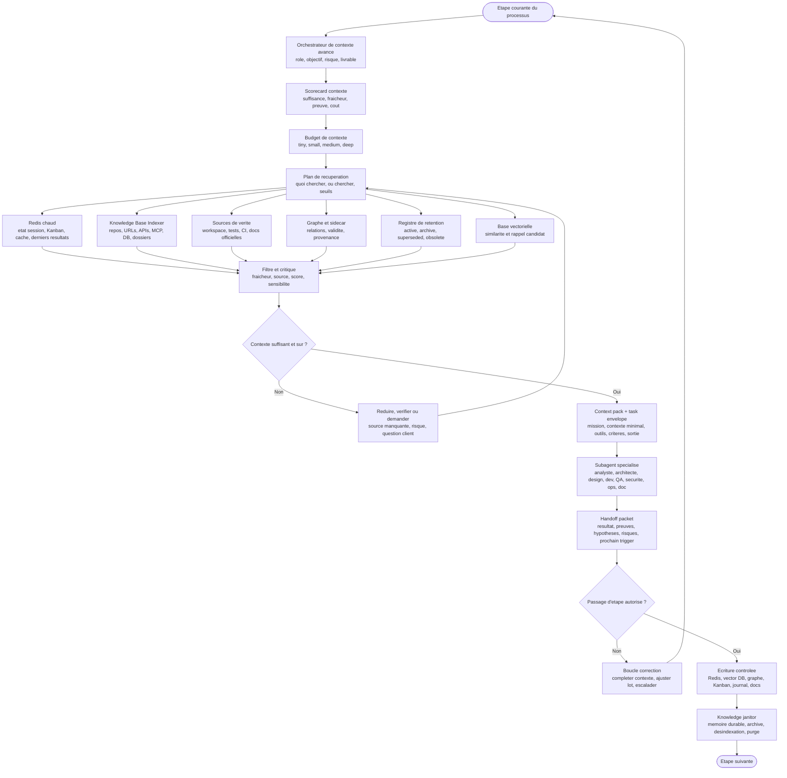

# Orchestration du contexte agentique

L'orchestration du contexte est la couche qui permet à l'entreprise-agent de rester légère, fiable et spécialisée. Elle décide quelle quantité de contexte donner à chaque étape, quel contexte récupérer depuis Redis, la base vectorielle, la base de connaissance indexée ou les sources de vérité, quel subagent appeler, puis quoi conserver pour la suite.

L'analogie humaine est simple : on ne donne pas toute l'histoire de l'entreprise à chaque personne. On donne à chacun une mission claire, les éléments nécessaires, les contraintes, les critères de réussite et le format de restitution. Une fois la tâche terminée, la personne produit un passage de relais exploitable pour déclencher la suite.

## Diagramme de la couche contexte



La source autonome est disponible dans [../diagrammes/orchestration-contexte-agentique.mmd](../diagrammes/orchestration-contexte-agentique.mmd).

## Principe directeur

Le contexte n'est pas un volume à maximiser. C'est un budget à optimiser. Un contexte utile doit être suffisant pour agir, assez petit pour rester maîtrisable, sourcé pour être vérifiable, et adapté au rôle qui le reçoit.

| Mauvais réflexe | Meilleur mécanisme |
| --- | --- |
| Tout charger dans le prompt principal. | Charger un profil de contexte adapté à l'étape. |
| Donner le même contexte à tous les subagents. | Donner une enveloppe de tâche spécialisée. |
| Croire la mémoire vectorielle. | Utiliser la mémoire comme indice puis vérifier la source. |
| Confondre base de connaissance et mémoire agentique. | Traiter la base de connaissance comme un corpus externe indexé, avec owner, ACL, fraîcheur et réindexation. |
| Garder indéfiniment l'état chaud. | Utiliser TTL, invalidation et séparation de mission. |
| Indexer toute production agentique. | Indexer seulement les connaissances durables, sourcées et non sensibles. |
| Réutiliser un vieux rapport parce qu'il est similaire. | Vérifier statut, fraîcheur, version et source active avant réutilisation. |
| Laisser le subagent conclure librement. | Exiger un handoff packet structuré. |

## Orchestrateur de contexte avancé

L'orchestrateur de contexte avancé est le plan de contrôle situé au-dessus des différents niveaux de mémoire. Redis, vector DB, graphe, sidecar, journal et sources de vérité fournissent des signaux ; l'orchestrateur décide lesquels sont utilisables, dans quel ordre, avec quel budget, pour quel rôle et avec quel niveau de preuve.

Il ne constitue pas une mémoire supplémentaire. Il transforme des mémoires hétérogènes, bases de connaissance indexées et sources actives en contexte opérationnel vérifié.

| Responsabilité | Décision attendue |
| --- | --- |
| Classifier la tâche | étape, rôle, complexité, risque, confidentialité, livrable. |
| Choisir le profil | intake, discovery, cadrage, architecture, implémentation, QA, sécurité, livraison, capitalisation. |
| Arbitrer les couches mémoire | fenêtre active, contexte chaud, vectoriel, graphe, sidecar, journal, source de vérité. |
| Interroger la base de connaissance | choisir les corpus autorisés, filtres, connecteurs, seuils, ACL et stratégie de vérification. |
| Calculer le budget | tiny, small, medium ou deep, avec justification si extension. |
| Critiquer les sources | fraîcheur, statut, validité, contradiction, sensibilité, propriétaire. |
| Composer le context pack | sources incluses, sources exclues, résumé sourcé, contraintes et critères. |
| Gouverner la délégation | task envelope, outils autorisés, modèle autorisé, format de handoff. |
| Décider la persistance | Redis, mémoire durable, archive, désindexation, purge ou incident. |

### Séquence de décision

| Étape | Question de contrôle | Sortie |
| --- | --- | --- |
| 1. Intake contextuel | Que cherche-t-on à décider ou produire ? | objectif contextualisé. |
| 2. Profilage | Quel rôle doit agir et quel risque porte la tâche ? | profil + budget initial. |
| 3. Récupération | Quelles sources candidates sont autorisées ? | liste sourcée et filtrée. |
| 4. Critique | Le contexte est-il frais, cohérent et suffisant ? | scorecard contexte. |
| 5. Compression | Peut-on réduire sans perdre de contrainte critique ? | résumé sourcé ou refus. |
| 6. Délégation | Quel agent reçoit quel paquet de contexte ? | context pack + task envelope. |
| 7. Retour | Le handoff prouve-t-il assez pour avancer ? | transition, correction ou escalade. |
| 8. Rétention | Que faut-il garder, invalider ou oublier ? | écriture contrôlée ou nettoyage. |

### Context scorecard

| Critère | Seuil attendu |
| --- | --- |
| Suffisance | Les critères d'acceptation et contraintes utiles sont présents. |
| Provenance | Toute source critique est identifiable et active. |
| Fraîcheur | Les versions, dates et statuts ne sont pas obsolètes. |
| Cohérence | Les contradictions sont résolues ou explicitement portées comme risques. |
| Minimisation | Le contexte transmis est le plus petit paquet fiable. |
| Sensibilité | Les données sensibles sont exclues, masquées ou routées vers un modèle autorisé. |
| Vérifiabilité | Les affirmations durables renvoient à une preuve ou source de vérité. |

### Context pack

Le context pack est la sortie directe de l'orchestrateur de contexte. Il complète le task envelope : le task envelope dit quoi faire, le context pack dit avec quelles informations vérifiées.

```yaml
context_pack:
  mission_id: "MIS-001"
  context_profile: "architecture"
  budget: "deep"
  included_sources:
    - id: "SRC-adr-12"
      status: "active"
      reason: "decision architecture actuelle"
      confidence: "high"
    - id: "SRC-incident-04"
      status: "active"
      reason: "risque deja observe"
      confidence: "medium"
  excluded_sources:
    - id: "SRC-old-report"
      reason: "superseded"
  constraints:
    - "verifier toute source vectorielle contre sa source active"
    - "ne pas transmettre de donnees sensibles non minimisees"
  scorecard:
    sufficiency: "ok"
    provenance: "ok"
    freshness: "warning"
    sensitivity: "ok"
```

## Profils de contexte

| Profil | Budget | Sources prioritaires | Subagent typique | Sortie attendue |
| --- | --- | --- | --- | --- |
| Intake | small | demande client, brief, Kanban, mémoire récente | analyste besoin | reformulation, questions, risques initiaux |
| Discovery | medium | docs projet, tickets, workspace, vector DB | analyste / explore | contexte utile, hypothèses, zones floues |
| Cadrage | medium | brief, CDC, références, décisions précédentes | product / analyste | CDC niveau 0 ou 1, critères d'acceptation |
| Architecture | deep | CDC, ADR, contraintes, existant, références | architecte | options, décision, compromis, risques |
| Design UI/DA | medium | charte graphique, design system, maquettes, parcours, WCAG, assets validés | UX/UI designer / direction artistique | recommandations, règles visuelles, critères de validation |
| Implémentation | small | carte Kanban, fichiers ciblés, conventions, tests liés | développeur | patch ciblé, tests, limites |
| QA | small | diff, critères, commandes test, erreurs | QA | rapport de validation ou défauts |
| Sécurité | medium | périmètre, données, outils, diff, menaces | sécurité | risques, sévérité, blocages, corrections |
| Livraison | small | changelog, preuves, risques, DoD | ops / documentation | dossier d'acceptation, runbook, suivi |
| Capitalisation | tiny | décisions validées, preuves, apprentissages stables | mémoire / orchestrateur | mise à jour mémoire, docs, backlog |

## Budgets de contexte

| Budget | Usage | Contenu typique | Interdit |
| --- | --- | --- | --- |
| tiny | Passage d'état, capitalisation, décision simple. | objectif, décision, preuve clé, prochain trigger | historique complet, logs longs |
| small | Tâche ciblée ou subagent spécialisé. | brief court, fichiers ciblés, contraintes, critères | documents entiers non nécessaires |
| medium | Analyse, cadrage, sécurité ou investigation. | résumé projet, sources pertinentes, hypothèses, exemples | contexte non sourcé ou obsolète |
| deep | Architecture, reprise complexe, incident majeur. | CDC, cartes, ADR, traces, références, options | données sensibles non minimisées |

Le budget peut augmenter seulement si un hook ou une preuve montre que le contexte actuel est insuffisant. Il doit redescendre après synthèse, sinon l'orchestrateur transporte trop de bruit vers les étapes suivantes.

## Task envelope

Le task envelope est le contrat envoyé à un subagent. Il limite le contexte et rend la sortie vérifiable.

```yaml
mission: "Corriger le comportement de validation"
stage: "implementation"
role: "developer"
context_budget: "small"
goal: "Faire passer les criteres d'acceptation de la carte KAN-42"
scope:
  files:
    - "src/validation/*"
  out_of_scope:
    - "refactor global"
context:
  brief: "Resume court du besoin"
  sources:
    - path: "docs/spec.md"
      reason: "criteres d'acceptation"
    - path: "tests/validation.test.ts"
      reason: "preuve de regression"
tools:
  allowed:
    - "read"
    - "edit"
    - "test"
  denied:
    - "network"
    - "production"
success_criteria:
  - "tests de validation passants"
  - "diff limite au perimetre"
handoff_schema:
  - summary
  - files_changed
  - tests_run
  - evidence
  - assumptions
  - risks
  - next_trigger
```

## Handoff packet

Le handoff packet est le paquet de passage de relais. Il évite que chaque étape reparte de zéro ou transporte trop de détails.

| Champ | Contenu |
| --- | --- |
| Résumé | Ce qui a été compris et produit en quelques lignes. |
| Preuves | Tests, liens, fichiers, résultats d'outils, captures ou diagnostics. |
| Hypothèses | Ce qui reste supposé et doit être vérifié. |
| Risques | Risques nouveaux, résiduels ou bloquants. |
| Changements | Fichiers, cartes, docs, mémoire ou configuration modifiés. |
| Décisions | Arbitrages pris ou à demander au client. |
| Mémoire | Ce qui peut être écrit, mis à jour, invalidé ou ignoré. |
| Prochain trigger | Étape suivante : QA, sécurité, livraison, clarification, correction. |

## Redis et base vectorielle

| Besoin | Redis chaud | Base vectorielle |
| --- | --- | --- |
| Savoir où en est la mission | état courant, étape, carte, blocage | non prioritaire |
| Retrouver une connaissance ancienne | cache de dernier résultat si récent | recherche sémantique avec métadonnées |
| Éviter de relire un gros fichier | résumé temporaire avec TTL | résumé indexé si stable et validé |
| Déclencher la suite | événement, file, verrou, statut Kanban | non prioritaire |
| Réutiliser un pattern | cache court si même session | exemples passés, ADR, incidents, décisions |
| Réduire les hallucinations | pointer vers sources récentes | fournir candidats sourcés à vérifier |

Redis répond à la question : où en est-on maintenant ? La base vectorielle répond : qu'a-t-on déjà appris qui ressemble à ce cas ? Les sources de vérité répondent : qu'est-ce qui est réellement vrai maintenant ? Le graphe de connaissances et le sidecar structuré complètent cette base quand il faut relier décisions, preuves, tâches et validité temporelle.

## Memory gate et source registry

| Décision | Contrôle |
| --- | --- |
| Écriture mémoire | source active, portée, sensibilité, TTL, stabilité. |
| Lecture mémoire | fraîcheur, statut, validité temporelle, contradiction, score. |
| Indexation | durabilité, non-sensibilité, propriétaire, métadonnées. |
| Réutilisation critique | retour à la source de vérité ou au dossier de preuve. |
| Invalidation | source remplacée, incident, secret, release ou décision annulée. |

La mémoire peut proposer un contexte, mais le passage de relais doit citer les sources actives ou les preuves qui justifient son usage.

## Hooks dédiés au contexte

| Hook | Déclenchement | Contrôle |
| --- | --- | --- |
| Pre-context-load | Avant récupération de contexte. | Budget, sources autorisées, données sensibles, pertinence. |
| Pre-context-reuse | Avant réutilisation d'une source récupérée. | Statut actif, fraîcheur, valid_until, superseded_by, sensibilité. |
| Post-context-load | Après récupération. | Score, fraîcheur, doublons, contradictions, taille. |
| Pre-delegation | Avant subagent. | Task envelope complet, outils limités, sortie attendue. |
| Post-subagent | Après subagent. | Handoff packet conforme, preuves présentes, risques visibles. |
| Pre-memory-write | Avant Redis/vector DB/mémoire. | Fait stable, source, portée, absence de secret, TTL. |
| Pre-index | Avant indexation vectorielle. | Source durable, owner, métadonnées, non-sensibilité. |
| Scheduled-cleanup | Périodique. | TTL expirés, sources remplacées, embeddings obsolètes, handoffs temporaires. |
| Pre-stage-transition | Avant étape suivante. | DoD de l'étape, trigger clair, blocages fermés ou escaladés. |
| Context-invalidation | Après changement majeur. | Caches et embeddings à invalider ou réindexer. |

## Machine d'état simplifiée

| État | Entrée | Sortie normale | Blocage |
| --- | --- | --- | --- |
| NeedContext | étape courante connue | profil choisi | étape ou mission floue |
| Retrieve | profil et budget définis | sources candidates | source interdite ou absente |
| Critique | sources candidates | contexte minimal validé | contradiction ou score faible |
| Delegate | task envelope prêt | subagent lancé | outils trop larges, sortie floue |
| Handoff | subagent terminé | paquet de relais | preuve absente, hypothèse critique |
| Persist | paquet validé | Redis/vector/Kanban/docs mis à jour | secret, mémoire non sourcée |
| Transition | DoD étape atteinte | étape suivante | validation client requise |

## Modes de défaillance

| Risque | Symptôme | Réponse |
| --- | --- | --- |
| Contexte trop maigre | Le subagent rate une contrainte. | Augmenter budget, récupérer source de vérité, relancer. |
| Contexte créatif absent | L'UI ou la DA diverge de la marque. | Récupérer charte, design system, maquettes ou demander validation. |
| Contexte trop large | Réponse confuse, coûts élevés, perte de focus. | Résumer, réduire au scope, créer task envelope plus strict. |
| Récupération trompeuse | Document similaire mais mauvais projet/version. | Filtrer par métadonnées, vérifier source, baisser confiance. |
| Mémoire polluée | Fait faux réutilisé plus tard. | Pre-memory-write strict, correction et invalidation. |
| Fragmentation subagents | Personne ne garde la cohérence globale. | Orchestrateur propriétaire du plan et du dossier d'acceptation. |
| Redis périmé | Ancien état utilisé après changement. | TTL court, invalidation par hook, version de mission. |
| Corpus ingouvernable | Trop de vieux rapports ou handoffs polluent les résultats. | Knowledge janitor, rétention, désindexation et purge. |
| Routage modèle implicite | Modèle choisi par défaut sans tenir compte du risque. | Pre-model-route et politique de routage par tâche. |
| Passage d'étape prématuré | QA ou sécurité découvre une exigence oubliée. | Pre-stage-transition basé sur DoD et preuves. |

## Règle finale

Un bon système agentique ne cherche pas à tout mettre dans le contexte. Il cherche à faire circuler des paquets de contexte courts, sourcés et spécialisés, puis à transformer chaque sortie en preuve, décision ou prochain déclencheur.
