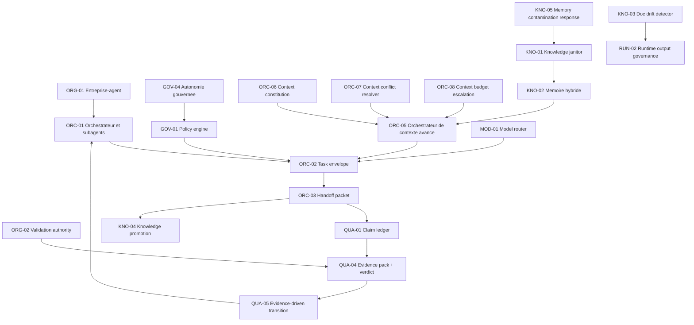

# Relations entre patterns agentiques

Cette matrice rend visibles les dépendances entre patterns. Elle évite de traiter le catalogue comme une liste plate : certains patterns fondent les autres, certains contrôlent leur usage, d'autres produisent les preuves nécessaires.

## Graphe simplifié

## Types de relation

| Relation | Sens |
| --- | --- |
| dépend de | Le pattern ne fonctionne pas correctement sans l'autre. |
| contrôle | Le pattern autorise, bloque, limite ou escalade l'autre. |
| produit preuve pour | Le pattern génère les preuves nécessaires à l'autre. |
| consomme | Le pattern utilise l'artefact ou la décision d'un autre pattern. |
| corrige | Le pattern traite un incident ou défaut produit par l'échec d'un autre. |

## Matrice principale

| Pattern | Dépend de | Contrôlé par | Produit pour |
| --- | --- | --- | --- |
| ORG-01 Entreprise-agent | aucun | GOV-04 | ORC-01, ORG-02 |
| ORG-02 Validation authority | ORG-01 | GOV-01 | QUA-04, QUA-05 |
| ORC-01 Orchestrateur et subagents | ORG-01 | GOV-01, GOV-04 | ORC-02, ORC-03 |
| ORC-02 Task envelope | ORC-01, ORC-05 | GOV-01, MOD-01 | ORC-03, QUA-01 |
| ORC-03 Handoff packet | ORC-02 | QUA-01 | QUA-04, KNO-04 |
| ORC-04 Context router | KNO-02 | ORC-06, ORC-07 | ORC-05 |
| ORC-05 Orchestrateur de contexte avancé | ORC-04, KNO-02 | GOV-01, ORC-06, ORC-08 | context pack, scorecard |
| ORC-06 Context constitution | ORG-01 | GOV-01 | règles de vérité contextuelle |
| ORC-07 Context conflict resolver | ORC-06, KNO-02 | ORG-02 | décision, risque ou escalade |
| ORC-08 Context budget escalation | ORC-05 | GOV-01, MOD-01 | justification d'augmentation |
| GOV-01 Policy engine et hooks | ORG-01 | ORG-02 | décisions allow/block/escalate |
| GOV-04 Autonomie gouvernée | ORG-02, GOV-01 | QUA-04 | niveau d'autonomie par tâche |
| QUA-01 Claim ledger | ORC-03 | QUA-02 | QUA-04 |
| QUA-04 Evidence pack et verdict | QUA-01 | ORG-02 | QUA-05 |
| QUA-05 Evidence-driven transition | QUA-04 | ORG-02, GOV-01 | transition d'étape |
| KNO-04 Knowledge promotion | ORC-03, QUA-04 | KNO-01 | mémoire durable |
| KNO-05 Memory contamination response | KNO-02, QUA-02 | GOV-01 | purge, correction, eval |

## Règle finale

Un pattern isolé est une bonne pratique. Un pattern relié devient une capacité gouvernable. La conformité doit donc vérifier les relations, pas seulement la présence nominale des patterns.
