# Relations entre patterns agentiques

Cette matrice rend visibles les dépendances entre patterns. Elle évite de traiter le catalogue comme une liste plate : certains patterns fondent les autres, certains contrôlent leur usage, d'autres produisent les preuves nécessaires.

## Graphe simplifié

```mermaid
flowchart TD
    ORG01["ORG-01 Entreprise-agent"] --> ORC01["ORC-01 Orchestrateur et subagents"]
    ORG02["ORG-02 Validation authority"] --> QUA04["QUA-04 Evidence pack + verdict"]
    GOV04["GOV-04 Autonomie gouvernee"] --> GOV01["GOV-01 Policy engine"]

    ORC01 --> ORC02["ORC-02 Task envelope"]
    ORC02 --> ORC03["ORC-03 Handoff packet"]
    ORC05["ORC-05 Orchestrateur de contexte avance"] --> ORC02
    ORC06["ORC-06 Context constitution"] --> ORC05
    ORC07["ORC-07 Context conflict resolver"] --> ORC05
    ORC08["ORC-08 Context budget escalation"] --> ORC05
    ORC10["ORC-10 Flow DSL minimal"] --> ORC09["ORC-09 Workflow State Engine"]
    ORC09 --> QUA05

    GOV01 --> ORC02
    GOV07["GOV-07 Tool blast-radius limiter"] --> GOV01
    GOV08["GOV-08 Guardrail contract"] --> GOV01
    GOV09["GOV-09 MCP Trust Gate"] --> GOV07
    GOV10["GOV-10 Policy by environment"] --> GOV01
    GOV11["GOV-11 Cluster action dry-run"] --> GOV02["GOV-02 Dry-run"]
    GOV12["GOV-12 Prompt Injection Firewall"] --> GOV01
    GOV13["GOV-13 Remote Hygiene Guard"] --> KNO06
    GOV14["GOV-14 Decision Council Gate"] --> ORG02
    MOD01["MOD-01 Model router"] --> ORC02

    ORC03 --> QUA01["QUA-01 Claim ledger"]
    QUA01 --> QUA04
    QUA04 --> QUA05["QUA-05 Evidence-driven transition"]
    QUA05 --> ORC01
    QUA08["QUA-08 Agent telemetry plane"] --> QUA04
    QUA09["QUA-09 Prompt/version observability"] --> QUA08
    QUA10["QUA-10 Trajectory logging"] --> QUA08
    QUA11["QUA-11 Browser evidence contract"] --> QUA04
    QUA12["QUA-12 Visual Evidence Pack"] --> QUA11
    QUA13["QUA-13 Eval lifecycle"] --> QUA09

    ORC03 --> KNO04["KNO-04 Knowledge promotion"]
    KNO06["KNO-06 Knowledge Base Indexer"] --> ORC04
    KNO06 --> ORC05
    KNO07["KNO-07 Memory integrity validator"] --> KNO02
    KNO08["KNO-08 Doc-to-graph pipeline"] --> KNO02
    KNO09["KNO-09 Knowledge narrative packaging"] --> QUA01
    KNO10["KNO-10 Source Graph Resolver"] --> ORC07
    KNO02["KNO-02 Memoire hybride"] --> ORC05
    KNO01["KNO-01 Knowledge janitor"] --> KNO02
    KNO05["KNO-05 Memory contamination response"] --> KNO01
    KNO03["KNO-03 Doc drift detector"] --> RUN02["RUN-02 Runtime output governance"]
    RUN06["RUN-06 Capability marketplace"] --> RUN07["RUN-07 Skill/capability lifecycle"]
    RUN08["RUN-08 Runtime provider contract"] --> RUN09["RUN-09 Agent backend boundary"]
    RUN10["RUN-10 Local agent worker pool"] --> RUN08
    RUN11["RUN-11 Workspace isolation"] --> RUN08
    RUN12["RUN-12 Secure local coordinator"] --> RUN08
```

## Types de relation

| Relation | Sens |
| --- | --- |
| dépend de | Le pattern ne fonctionne pas correctement sans l'autre. |
| contrôle | Le pattern autorise, bloque, limite ou escalade l'autre. |
| produit preuve pour | Le pattern génère les preuves nécessaires à l'autre. |
| consomme | Le pattern utilise l'artefact ou la décision d'un autre pattern. |
| corrige | Le pattern traite un incident ou défaut produit par l'échec d'un autre. |

## Matrice principale

| Pattern | Dépend de | Contrôlé par | Produit pour |
| --- | --- | --- | --- |
| ORG-01 Entreprise-agent | aucun | GOV-04 | ORC-01, ORG-02 |
| ORG-02 Validation authority | ORG-01 | GOV-01 | QUA-04, QUA-05 |
| ORC-01 Orchestrateur et subagents | ORG-01 | GOV-01, GOV-04 | ORC-02, ORC-03 |
| ORC-02 Task envelope | ORC-01, ORC-05 | GOV-01, MOD-01 | ORC-03, QUA-01 |
| ORC-03 Handoff packet | ORC-02 | QUA-01 | QUA-04, KNO-04 |
| ORC-04 Context router | KNO-02, KNO-06 | ORC-06, ORC-07 | ORC-05 |
| ORC-05 Orchestrateur de contexte avancé | ORC-04, KNO-02, KNO-06 | GOV-01, ORC-06, ORC-08 | context pack, scorecard |
| ORC-06 Context constitution | ORG-01 | GOV-01 | règles de vérité contextuelle |
| ORC-07 Context conflict resolver | ORC-06, KNO-02 | ORG-02 | décision, risque ou escalade |
| ORC-08 Context budget escalation | ORC-05 | GOV-01, MOD-01 | justification d'augmentation |
| ORC-09 Workflow State Engine | ORC-01, QUA-05 | GOV-01, GOV-08 | transitions, interruptions, reprises |
| ORC-10 Flow DSL minimal | ORC-09 | GOV-01 | flow validable et exportable |
| GOV-01 Policy engine et hooks | ORG-01 | ORG-02 | décisions allow/block/escalate |
| GOV-07 Tool blast-radius limiter | GOV-01 | GOV-08, GOV-10 | scope outil, décision policy |
| GOV-08 Guardrail contract | GOV-01 | ORG-02 | règles versionnées et métriques |
| GOV-09 MCP Trust Gate | GOV-07 | GOV-08 | confiance serveur/outils MCP |
| GOV-10 Policy by environment | GOV-01 | ORG-02 | profils local/staging/prod |
| GOV-11 Cluster action dry-run | GOV-02, RUN-03 | GOV-10, ORG-02 | plan impact, rollback, go/no-go |
| GOV-12 Prompt Injection Firewall | GOV-01, ORC-06 | GOV-08 | contenu externe isolé |
| GOV-13 Remote Hygiene Guard | KNO-06 | GOV-01 | audit remote, fraîcheur, quarantaine |
| GOV-14 Decision Council Gate | ORG-02, QUA-04 | GOV-01 | quorum, veto, désaccords |
| GOV-04 Autonomie gouvernée | ORG-02, GOV-01 | QUA-04 | niveau d'autonomie par tâche |
| QUA-01 Claim ledger | ORC-03 | QUA-02 | QUA-04 |
| QUA-04 Evidence pack et verdict | QUA-01 | ORG-02 | QUA-05 |
| QUA-05 Evidence-driven transition | QUA-04 | ORG-02, GOV-01 | transition d'étape |
| QUA-08 Agent telemetry plane | QUA-02 | GOV-08 | traces corrélées pour audit |
| QUA-09 Prompt/version observability | QUA-08, MOD-01 | GOV-08 | régression par version |
| QUA-10 Trajectory logging | QUA-08, QUA-03 | GOV-08 | trajectoire rejouable |
| QUA-11 Browser evidence contract | GOV-07 | ORG-02, GOV-10 | preuves visuelles |
| QUA-12 Visual Evidence Pack | QUA-11 | ORG-02 | captures, DOM, logs UI |
| QUA-13 Eval lifecycle | QUA-09 | GOV-08 | datasets, seuils, historique |
| KNO-04 Knowledge promotion | ORC-03, QUA-04 | KNO-01 | mémoire durable |
| KNO-05 Memory contamination response | KNO-02, QUA-02 | GOV-01 | purge, correction, eval |
| KNO-06 Knowledge Base Indexer | Source registry | GOV-01, GOV-09, KNO-07 | résultats sourcés pour ORC-04/ORC-05 |
| KNO-07 Memory integrity validator | KNO-02, KNO-06 | GOV-01 | audit mémoire, invalidation |
| KNO-08 Doc-to-graph pipeline | KNO-06 | ORC-07, QUA-01 | relations et contradictions sourcées |
| KNO-09 Knowledge narrative packaging | KNO-08, QUA-01 | KNO-07 | synthèses sourcées |
| KNO-10 Source Graph Resolver | KNO-08 | ORC-07, QUA-01 | source active, supersession, preuve |
| RUN-06 Capability marketplace | RUN-05 | GOV-01, QUA-08 | packs découvrables |
| RUN-07 Skill/capability lifecycle | RUN-06 | GOV-08, QUA-09 | promotion/retrait des skills |
| RUN-08 Runtime provider contract | RUN-02 | GOV-07, GOV-10 | lifecycle et health runtime |
| RUN-09 Agent backend boundary | RUN-08, MOD-01 | GOV-01 | ports/adapters backend |
| RUN-10 Local agent worker pool | RUN-08 | ORC-01, GOV-07 | queue, WIP, cleanup |
| RUN-11 Workspace isolation | RUN-08 | GOV-07 | root, mounts, secrets |
| RUN-12 Secure local coordinator | RUN-08, GOV-05 | GOV-07 | inbox signée, pas de proxy token |

## Règle finale

Un pattern isolé est une bonne pratique. Un pattern relié devient une capacité gouvernable. La conformité doit donc vérifier les relations, pas seulement la présence nominale des patterns.
