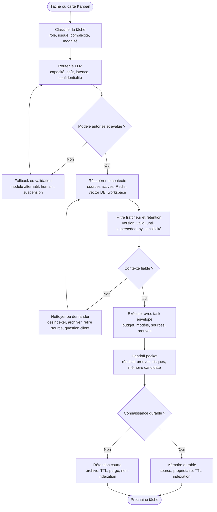

# Routage LLM et rétention des connaissances

Cette page formalise deux mécanismes de soutenabilité : choisir le bon modèle pour la bonne tâche, puis nettoyer les connaissances qui ne doivent pas devenir du contexte permanent. Plus l'entreprise-agent produit de rapports, handoffs, traces, décisions et documents, plus elle doit savoir quoi garder, quoi archiver, quoi désindexer et quoi oublier.

Le principe est proche de la rétention de logs : tout peut être utile à court terme, peu d'éléments méritent de devenir mémoire durable.

## Diagramme de flux

La source autonome est disponible dans [../diagrammes/routage-retention-connaissances.mmd](../diagrammes/routage-retention-connaissances.mmd).

## Routage LLM par tâche

Le routage LLM évite deux dérives : utiliser un modèle trop faible pour une décision risquée, ou utiliser un modèle coûteux pour une tâche simple. Le routage doit être explicite dans la carte ou le task envelope.

| Type de tâche | Modèle cible | Budget | Validation | Fallback |
| --- | --- | --- | --- | --- |
| Triage, classement, extraction simple | rapide, économique | tiny | échantillonnage | modèle standard ou règle déterministe |
| Synthèse de rapport court | rapide ou standard | small | source conservée | relire source ou modèle plus long contexte |
| Discovery ou cadrage ambigu | standard raisonnement | medium | analyste ou client | questions ciblées |
| Architecture, ADR, compromis | modèle profond | deep | critique + architecte | revue humaine ou atelier |
| Implémentation ciblée | modèle code fiable | small / medium | tests + QA | autre modèle code ou développeur humain |
| QA, critique, red-team | modèle fort en contradiction | medium | preuves et scorecard | revue humaine |
| Sécurité, données sensibles | modèle autorisé/confidentiel | medium | sécurité | modèle local ou suspension |
| UI, design, capture, maquette | modèle vision si besoin | medium | UX/UI/DA | revue design humaine |
| Documentation de livraison | standard, faible coût | small | diagnostics/liens | documentation humaine |
| Capitalisation mémoire | modèle précis et conservateur | tiny / small | pre-memory-write | ne pas mémoriser |

## Critères de routage

| Critère | Question |
| --- | --- |
| Rôle | Quel subagent agit : analyste, architecte, dev, QA, sécurité, critique, design, ops ? |
| Complexité | La tâche demande-t-elle raisonnement profond, code, vision, synthèse ou simple extraction ? |
| Risque | Une erreur peut-elle toucher production, sécurité, données, architecture ou client ? |
| Confidentialité | Le contexte peut-il sortir vers ce fournisseur ou ce modèle ? |
| Coût | Le budget tokens/coût est-il proportionné à la valeur de la carte ? |
| Latence | La tâche est-elle interactive, batch ou non urgente ? |
| Fenêtre de contexte | Le modèle peut-il recevoir le contexte minimal sans compression dangereuse ? |
| Evals | Ce modèle a-t-il réussi les cas représentatifs pour ce rôle ? |
| Fallback | Que fait-on si le modèle échoue, diverge, coûte trop cher ou devient indisponible ? |

## Politique de fallback

| Déclencheur | Réponse |
| --- | --- |
| Modèle non autorisé pour les données | route vers modèle local/autorisé ou stop. |
| Échec eval du rôle | bloquer la mission ou utiliser un modèle validé. |
| Coût supérieur au budget | compresser, réduire contexte, demander validation ou changer modèle. |
| Réponse instable | relancer avec prompt strict, critique indépendante ou modèle différent. |
| Divergence entre modèles | escalader au critique puis au validateur métier si nécessaire. |
| Contexte trop long | résumer avec sources, découper la tâche ou augmenter budget avec justification. |
| Modèle indisponible | fallback prévu, mode dégradé ou suspension. |

## Rétention des connaissances

Tout artefact doit avoir une destination : source de vérité active, mémoire durable, archive, rétention courte ou purge. L'absence de politique crée une dette documentaire et pollue les recherches futures.

| Type d'artefact | Rétention recommandée | Indexation vectorielle | Nettoyage |
| --- | --- | --- | --- |
| Décision client validée | durable | oui, avec source | remplacer si décision annulée |
| ADR ou décision architecture | durable versionnée | oui | superseded_by si remplacée |
| Charte graphique / design system | durable versionnée | oui | réindexer à chaque version |
| Contrat API / schéma | durable versionné | oui | désindexer versions obsolètes |
| Rapport d'audit temporaire | court à moyen terme | seulement résumé validé | archiver ou purger après délai |
| Handoff de tâche | court terme | non par défaut | synthétiser si apprentissage durable |
| Trace outil / logs | court terme | non | purge selon politique |
| Incident agentique | moyen à durable selon gravité | résumé post-mortem oui | purger détails sensibles |
| Hypothèse non validée | court terme | non | supprimer ou marquer hypothèse |
| Rapport remplacé | archive | non sauf valeur historique | marquer superseded_by |
| Donnée sensible | minimiser | non par défaut | purge ou procédure dédiée |
| Mémoire fausse | aucune | désindexer | correction + invalidation |

## Statuts de connaissance

| Statut | Sens | Utilisation par l'agent |
| --- | --- | --- |
| active | source actuelle faisant foi. | utilisable pour décision. |
| candidate | potentiellement utile mais non validée. | utilisable pour exploration seulement. |
| archived | conservée pour historique. | ne pas utiliser sans confirmation. |
| superseded | remplacée par une source plus récente. | ignorer, pointer vers remplaçant. |
| obsolete | plus fiable ou plus applicable. | désindexer ou bloquer. |
| sensitive | contient données sensibles. | minimiser, masquer, accès contrôlé. |
| purge_pending | à supprimer après validation. | ne pas utiliser. |
| durable_memory | fait stable, sourcé et réutilisable. | utilisable avec provenance. |

## Métadonnées obligatoires

| Métadonnée | Usage |
| --- | --- |
| source_id | Identifier l'artefact original. |
| title | Comprendre le contenu sans l'ouvrir. |
| type | ADR, brief, rapport, handoff, incident, charte, API, log, test. |
| owner | Savoir qui valide, remplace ou supprime. |
| created_at | Connaître l'âge. |
| updated_at | Évaluer la fraîcheur. |
| valid_until | Déclencher revue ou expiration. |
| status | active, archived, obsolete, superseded, sensitive. |
| superseded_by | Pointer vers la source actuelle. |
| sensitivity | public, interne, confidentiel, secret, données personnelles. |
| indexable | oui/non, et pourquoi. |
| retention_class | durable, projet, mission, court terme, purge. |
| embedding_version | Savoir si réindexation nécessaire. |
| confidence | Niveau de confiance utilisable par le context router. |

## Knowledge janitor

Le knowledge janitor est un rôle ou subagent chargé de l'hygiène documentaire. Il ne décide pas du métier, mais il maintient la qualité du corpus.

| Mission | Action |
| --- | --- |
| Détecter l'obsolescence | trouver rapports remplacés, sources anciennes, doublons et contradictions. |
| Proposer la rétention | durable, archive, TTL, purge ou réindexation. |
| Désindexer | retirer de la vector DB les sources obsolètes ou sensibles. |
| Résumer durablement | transformer un rapport temporaire en apprentissage stable et sourcé. |
| Nettoyer Redis | supprimer états de mission expirés et caches périmés. |
| Ouvrir des cartes | créer tâches de correction documentaire si décision nécessaire. |
| Auditer la mémoire | vérifier faits sans source, secrets, données personnelles ou portée trop large. |

## Hooks dédiés

| Hook | Moment | Bloque si |
| --- | --- | --- |
| Pre-model-route | Avant choix modèle | tâche, risque, données ou budget non qualifiés. |
| Post-model-route | Après choix modèle | modèle non évalué, non autorisé ou trop coûteux. |
| Pre-context-reuse | Avant utilisation d'une source récupérée | source obsolète, superseded, expired ou sensible. |
| Pre-index | Avant indexation vectorielle | source non durable, non sourcée, sensible ou sans owner. |
| Pre-cleanup-delete | Avant suppression | absence de propriétaire, impact inconnu, source active. |
| Scheduled-cleanup | Périodique | corpus sans revue, TTL expiré, embeddings obsolètes. |
| Post-release-retention | Après livraison | absence de décision sur ce qui devient mémoire ou archive. |

## Cadence de nettoyage

| Cadence | Travail |
| --- | --- |
| Après chaque mission | décider mémoire durable, archive courte, purge, réindexation. |
| Hebdomadaire | nettoyer Redis, handoffs temporaires, rapports brouillons. |
| Mensuelle | auditer vector DB, doublons, sources superseded, docs orphelines. |
| À chaque release | figer décisions, réindexer docs actives, archiver anciennes versions. |
| Après incident | purger mémoire contaminée, corriger sources, ajouter eval. |

## Règle de décision

Une information peut devenir mémoire durable seulement si elle est :

- stable ;
- sourcée ;
- validée ou issue d'un résultat d'outil ;
- non sensible ou correctement minimisée ;
- utile à plusieurs missions futures ;
- accompagnée d'un propriétaire et d'une règle d'expiration.

Sinon, elle reste temporaire, archivée ou supprimée.

## Règle finale

Un système agentique mature ne se contente pas d'accumuler du contexte. Il sait choisir le modèle adapté, vérifier que ses sources sont encore vivantes, conserver ce qui est durable et nettoyer le reste avant que le corpus ne devienne ingouvernable.
