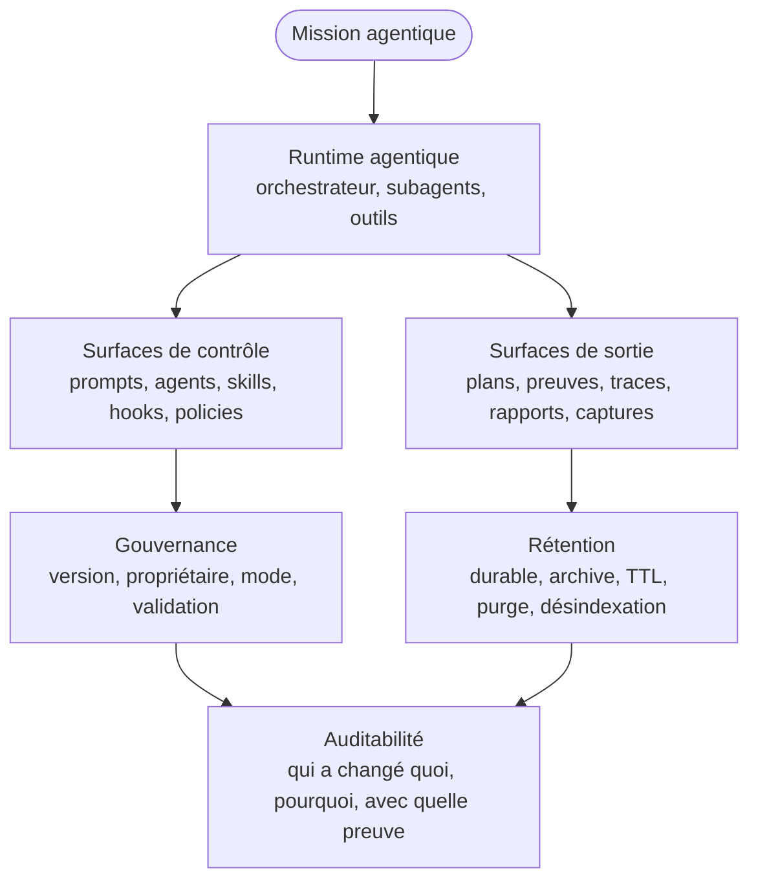

# Runtime agentique et surfaces gouvernées

Cette page étend le standard avec les patterns issus d'un runtime agentique réel. Une structure agentique mature ne se limite pas à des rôles et des prompts : elle produit des artefacts, active des hooks, trace des décisions, crée parfois de nouvelles capacités et doit gouverner ces surfaces comme du logiciel.

## Principe

Un runtime agentique DOIT rendre visibles ses surfaces de contrôle et ses surfaces de sortie. Il NE DOIT PAS laisser les artefacts générés, traces, hooks, agents dynamiques ou sorties temporaires devenir un second système non gouverné.

La source autonome est disponible dans [../diagrammes/runtime-surfaces-agentiques.mmd](../diagrammes/runtime-surfaces-agentiques.mmd).

## Surfaces de contrôle

| Surface | Rôle | Risque | Contrôle minimal |
| --- | --- | --- | --- |
| Instructions globales | Définir comportement stable. | contradiction, dérive, priorité ambiguë. | version, propriétaire, revue. |
| Prompts de rôle | Encadrer un agent ou subagent. | hallucination institutionnalisée. | tests, exemples, evals. |
| Skills | Encapsuler procédures réutilisables. | procédure obsolète ou trop large. | préconditions, sorties, score qualité. |
| Agents dynamiques | Ajouter une capacité spécialisée. | prolifération, responsabilité floue. | triage durabilité, expiration, promotion. |
| Workflows | Orchestrer étapes et transitions. | boucle infinie, passage prématuré. | DoR/DoD, circuit breaker, preuves. |
| Workflow state manifests | Déclarer états, guards et interruptions. | logique cachée, reprise impossible. | validation, evidence gate, ledger. |
| Hooks | Bloquer ou observer actions critiques. | blocage excessif ou faux sentiment de sécurité. | mode shadow/canary/enforced, registre. |
| Policies | Décider allow/warn/block/escalate. | règle implicite ou contournable. | registre, journal, tests. |
| MCP et outils | Connecter systèmes externes. | fuite, mutation non autorisée. | scopes, timeout, logs, validation. |
| Runtime providers | Exécuter local, IDE, distant ou cluster. | secrets exposés, ressources non contrôlées. | provider contract, health, cleanup. |
| Capability packs | Distribuer rôles, prompts et skills. | prolifération ou capacité obsolète. | owner, version, tests, lifecycle. |

## Surfaces de sortie

| Surface | Usage | Rétention recommandée |
| --- | --- | --- |
| Planning artifacts | Décisions, plans, PRD, tickets. | durable ou projet, avec version. |
| Implementation artifacts | preuves de patch, diff, notes, limites. | projet ou court terme selon valeur. |
| Test artifacts | rapports, logs, captures, résultats. | projet si preuve, court terme sinon. |
| Traces agentiques | prompts, outils, coûts, décisions. | court à moyen terme, minimisation. |
| Visual evidence | captures ou rendus. | TTL court sauf preuve d'acceptation. |
| Runtime logs | diagnostic et audit. | politique de logs, purge. |
| Memory projections | index vectoriels, graphe, caches. | réindexation, désindexation, invalidation. |
| Dynamic artifacts | agents, prompts, skills ou hooks générés. | éphémère par défaut, promotion si réutilisé. |
| Trajectory logs | Séquence intention -> action -> observation -> décision. | TTL selon risque, minimisation. |
| Browser evidence | DOM, screenshots, console et réseau. | TTL court sauf preuve d'acceptation ou incident. |

## Runtime provider contract

Un runtime provider DOIT exposer le même contrat minimal, qu'il soit local, IDE, subprocess, tmux, ACP, distant ou Kubernetes.

| Dimension | Obligation |
| --- | --- |
| Lifecycle | prepare, spawn, execute, observe, stop, cleanup. |
| Ressources | CPU, mémoire, durée, fichiers, réseau et secrets limités. |
| Sécurité | env scrub, workspace isolation, path allowlist, network policy. |
| Observabilité | trace_id, logs, health, coût, erreurs, cleanup status. |
| Compatibilité | outils, modèles, MCP et capabilities déclarés avant usage. |

## Capability marketplace et lifecycle

Les capacités ne sont pas de simples prompts. Elles DOIVENT être publiées comme capability packs ou skill records.

| Statut | Usage |
| --- | --- |
| draft | conception, non routable automatiquement. |
| experimental | usage limité, preuves en collecte. |
| canary | disponible sur périmètre réduit. |
| enforced | capacité stable, routable selon policy. |
| deprecated | remplacement prévu, usage restreint. |
| retired | non routable, historique conservé. |

## Cycle de vie des hooks

| Mode | Sens | Usage attendu |
| --- | --- | --- |
| shadow | Observe sans bloquer. | Découvrir faux positifs et mesurer impact. |
| canary | S'applique à une surface limitée ou signale plus fortement. | Valider la règle avant enforcement. |
| enforced | Bloque réellement. | Protéger les actions dont le risque est compris. |
| retired | N'est plus actif. | Conserver historique et raison de retrait. |

Un hook DEVRAIT progresser de `shadow` vers `canary`, puis `enforced`. Un hook nouveau NE DEVRAIT PAS commencer en blocage total sauf risque critique évident.

## Dynamic factory contrôlée

Une structure agentique peut créer de nouvelles capacités, mais cette création DOIT être gouvernée.

| Étape | Question | Sortie |
| --- | --- | --- |
| Gap detection | Aucune capacité existante ne couvre-t-elle le besoin ? | gap qualifié. |
| Classification | Faut-il un agent, workflow, skill, hook ou instruction ? | type d'artefact. |
| Triage de durabilité | Le besoin est-il ponctuel ou récurrent ? | éphémère ou permanent. |
| Création | Quel builder ou rôle crée l'artefact ? | artefact initial. |
| Validation | L'artefact respecte-t-il contrat, sécurité et qualité ? | go/no-go. |
| Usage tracking | Est-il réellement réutilisé ? | compteur, signaux. |
| Promotion ou purge | Devient-il durable ? | promotion, archive ou suppression. |

## Triage éphémère / permanent

| Signal | Décision recommandée |
| --- | --- |
| Besoin ponctuel, expérimental ou très spécifique. | artefact éphémère avec expiration. |
| Besoin récurrent dans le cycle produit. | candidat permanent. |
| Capacité transversale sécurité, qualité, performance ou documentation. | candidat permanent avec revue. |
| Artefact utilisé plusieurs fois avec succès. | promotion vers durable. |
| Artefact non réutilisé ou remplacé. | archive ou purge. |

## Runtime output governance

Toute sortie runtime DOIT avoir :

- un propriétaire ;
- un type ;
- une source ou mission liée ;
- une sensibilité ;
- une règle de rétention ;
- un statut d'indexation ;
- un lien avec preuve, décision ou incident si elle sert à gouverner.

## Doc drift detector

Une structure mature DEVRAIT détecter la dérive entre :

- documentation ;
- manifests ;
- prompts ;
- hooks ;
- workflows ;
- code réel ;
- mémoire indexée ;
- sorties runtime.

| Drift | Exemple | Réponse |
| --- | --- | --- |
| Doc -> runtime | la doc annonce un hook absent. | corriger doc ou créer hook. |
| Runtime -> doc | un outil existe mais n'est pas documenté. | mettre à jour registre outil. |
| Manifest -> fichier | agent déclaré mais fichier absent. | bloquer release. |
| Mémoire -> source | mémoire cite une décision remplacée. | désindexer ou corriger mémoire. |
| Workflow -> preuve | étape Done sans preuve attendue. | ajouter evidence gate. |

## Model retirement guard

Le routage LLM DOIT intégrer le retrait des modèles. Un modèle peut devenir interdit parce qu'il est obsolète, non disponible, trop coûteux, non conforme à la confidentialité ou insuffisant pour un type de tâche.

| Statut modèle | Comportement |
| --- | --- |
| active | utilisable selon routage. |
| restricted | utilisable seulement pour certains rôles ou données. |
| deprecated | fallback recommandé, migration planifiée. |
| disallowed | rejet et fallback obligatoire. |
| local_only | utilisable uniquement en environnement local ou privé. |

## Règle finale

Un runtime agentique mature DOIT traiter ses propres artefacts comme un produit : versionnés, contrôlés, audités, nettoyés et reliés aux exigences qu'ils satisfont.
