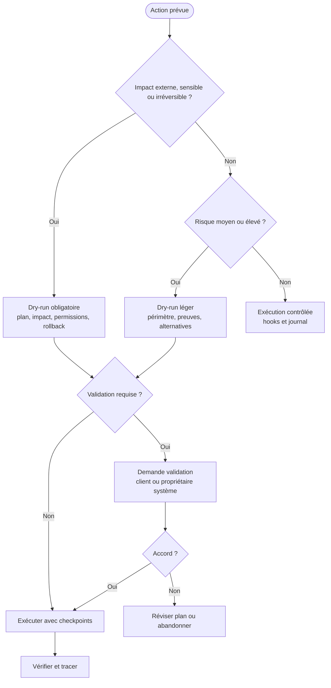

# Simulation pré-exécution agentique

La simulation pré-exécution, ou dry-run, permet de vérifier un plan avant de toucher à l'état réel. Elle est obligatoire quand une action peut être coûteuse, irréversible, externe, sensible ou difficile à tester après coup.

## Quand simuler

| Situation | Simulation requise |
| --- | --- |
| Suppression, migration ou reset | toujours. |
| Production, cloud, dépôt distant ou MCP en écriture | toujours. |
| Refactoring large | si impact multi-modules. |
| Ajout de dépendance structurante | avant installation ou adoption. |
| Changement d'architecture | avant décision. |
| Manipulation de données sensibles | avant accès ou transformation. |
| UI publique ou direction artistique | avant implémentation si charte absente ou ambiguë. |
| Coût élevé en tokens, temps ou infrastructure | avant exécution. |

## Contenu du dry-run

| Élément | Description |
| --- | --- |
| Objectif | Résultat attendu et carte Kanban concernée. |
| Plan d'action | Étapes prévues, ordre, alternatives. |
| Fichiers ou systèmes touchés | Périmètre exact, hors-scope, propriétaires. |
| Outils appelés | Commandes, MCP, réseau, navigateur, CI, cloud. |
| Permissions nécessaires | Lecture, écriture, réseau, secrets, production. |
| Risques | Perte de données, régression, coût, sécurité, lock-in. |
| Rollback | Comment revenir en arrière ou limiter les dégâts. |
| Vérifications | Tests, scans, rendu, revue, evals, smoke. |
| Décisions humaines | Accord nécessaire avant exécution. |

## Diagramme de décision



## Checkpoints

| Checkpoint | Question |
| --- | --- |
| Avant outil | L'action correspond-elle au dry-run validé ? |
| Après étape | Le résultat réel correspond-il au résultat attendu ? |
| Avant écriture | Le diff est-il dans le périmètre ? |
| Avant transition | Les preuves sont-elles suffisantes ? |
| Avant livraison | Le rollback reste-t-il possible ou documenté ? |

## Sortie attendue

```yaml
mission: "KAN-42"
risk_level: "high"
planned_actions:
  - "modifier schema de validation"
  - "lancer tests contrat"
impacted_assets:
  - "src/validation"
  - "tests/validation"
permissions:
  required:
    - "write_local"
    - "test_local"
  denied:
    - "production"
rollback:
  strategy: "revert diff local"
validation_required:
  - "QA"
  - "client si comportement change"
go_no_go: "go apres validation QA"
```

## Règle finale

Le dry-run ralentit légèrement l'action, mais il accélère la confiance. Plus l'action est risquée, plus l'agent doit expliquer ce qu'il va faire avant de le faire.
